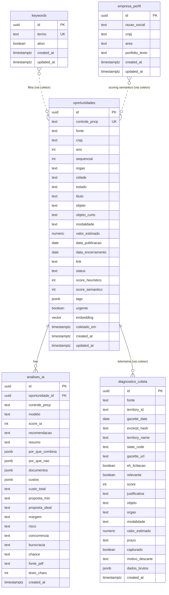

# Data Architecture: Radar PNCP

## Diagrama de Entidades (Mermaid)



## Contexto: Sem Autenticacao

Este projeto **nao tem autenticacao**. O frontend usa a `anon key` do Supabase. Todas as tabelas tem RLS habilitado, mas as policies refletem acesso publico:

- `oportunidades` e `analises_ia`: somente SELECT para anon (escrita via service_role nas Edge Functions).
- `keywords`: CRUD completo para anon (o usuario edita diretamente pelo frontend).
- `empresa_perfil`: CRUD completo para anon (o usuario edita o perfil pelo frontend; coletor le via service_role).
- `diagnostico_coleta`: somente SELECT para anon (escrita via service_role nas Edge Functions). Tabela append-only de telemetria.

Quando auth for implementado, as policies de escrita em `keywords` e `empresa_perfil` devem ser restringidas. Marcadores `TODO[auth]` estao no SQL das migrations.

## Tabelas

### oportunidades

Cache de editais analisados vindos de multiplas fontes (PNCP, Querido Diario, futuras). Escrita exclusiva via Edge Function (service_role). Leitura publica.

**Migration:** `20260608120000_init_radar.sql` + `20260608130000_v2_coleta_semantica.sql` + `20260608180000_multifonte.sql`

### analises_ia

Resultado da analise por LLM sobre o PDF do edital. FK para `oportunidades` com ON DELETE CASCADE. Escrita via service_role. Leitura publica.

**Migration:** `20260608120000_init_radar.sql`

### keywords

Fonte de verdade das palavras-chave monitoradas pelo radar. Substitui `DEFAULT_KEYWORDS` (localStorage/constante). O coletor diario (Edge Function `coletar-pncp`) consulta `SELECT termo FROM keywords WHERE ativo = true` para filtrar editais no PNCP.

```sql
create table if not exists public.keywords (
  id         uuid        primary key default gen_random_uuid(),
  termo      text        not null unique,
  ativo      boolean     not null default true,
  created_at timestamptz not null default now(),
  updated_at timestamptz not null default now()
);
```

**Migration:** `20260608140000_create_keywords_table.sql`

**Relacionamento conceitual:** keywords nao tem FK para oportunidades. A relacao e indireta — o coletor usa os termos ativos como filtro de busca na API do PNCP, e os resultados viram registros em `oportunidades`.

### empresa_perfil

Singleton: perfil da empresa (razao social, CNPJ, area de atuacao e texto de portfolio). Substitui o objeto `empresa` hardcoded em `src/lib/data.ts` e a constante `PERFIL` no coletor `coletar-pncp/index.ts`. O frontend edita a linha unica; o coletor le `portfolio_texto` para alimentar embeddings e scoring semantico.

```sql
create table if not exists public.empresa_perfil (
  id               uuid        primary key default '00000000-0000-0000-0000-000000000001'::uuid
                               check (id = '00000000-0000-0000-0000-000000000001'::uuid),
  razao_social     text        not null,
  cnpj             text        not null,
  area             text        not null,
  portfolio_texto  text        not null,
  created_at       timestamptz not null default now(),
  updated_at       timestamptz not null default now()
);
```

**Migration:** `20260608150000_create_empresa_perfil.sql`

**Garantia de singleton:** CHECK constraint no `id` fixa o UUID em `00000000-...0001`. Qualquer INSERT com outro id falha no CHECK; qualquer INSERT com o mesmo id falha no PK. Resultado: maximo 1 linha, impossivel de violar no nivel do banco.

**Relacionamento conceitual:** empresa_perfil nao tem FK para oportunidades. A relacao e indireta — o coletor le `portfolio_texto` para gerar embeddings e calcular score semantico, e o resultado e gravado em `oportunidades.score_semantico`.

### diagnostico_coleta

Telemetria de classificacao IA do coletor. Registra **todos** os resultados da analise — tanto excerpts capturados (gravados em `oportunidades`) quanto descartados (silenciados antes desta feature). Tabela **append-only** no MVP: registros nao sao atualizados individualmente, exceto por upsert de reprocessamento (mesma fonte + excerpt reanalisado).

Escrita exclusiva via Edge Function (service_role). Leitura publica para consulta via Supabase Dashboard ou SQL.

```sql
create table if not exists public.diagnostico_coleta (
  id              uuid        primary key default gen_random_uuid(),
  fonte           text        not null,                              -- 'querido-diario', 'pncp', futuras
  territory_id    text,                                              -- id do municipio (Querido Diario); null para fontes sem territorio
  gazette_date    date,                                              -- data de publicacao do diario; null para fontes sem data de gazette
  excerpt_hash    text        not null,                              -- hash deterministic do excerpt (sha256 truncado, 16 hex)
  territory_name  text,                                              -- nome do municipio (debug/display)
  state_code      text,                                              -- UF do municipio (ex: 'SP', 'RJ')
  gazette_url     text,                                              -- URL do diario original
  eh_licitacao    boolean,                                           -- classificacao IA: e licitacao?
  relevante       boolean,                                           -- classificacao IA: e relevante pro perfil?
  score           int,                                               -- score IA 0-100
  justificativa   text,                                              -- texto livre da IA explicando a decisao
  objeto          text,                                              -- objeto extraido pela IA
  orgao           text,                                              -- orgao responsavel extraido pela IA
  modalidade      text,                                              -- modalidade licitatoria extraida pela IA
  valor_estimado  numeric,                                           -- valor estimado extraido pela IA (pode ser null)
  prazo           text,                                              -- prazo/data limite extraido pela IA (texto livre)
  capturado       boolean     not null default false,                -- true = gravado em oportunidades; false = descartado
  motivo_descarte text        check (motivo_descarte in (
                                'nao_e_licitacao',
                                'nao_relevante',
                                'score_abaixo_threshold',
                                'erro_ia',
                                'erro_gravacao'
                              ) or motivo_descarte is null),         -- null quando capturado=true
  dados_brutos    jsonb,                                             -- excerpt original + metadata extra (debug)
  created_at      timestamptz not null default now(),

  -- Constraint unica para idempotencia: mesmo excerpt da mesma fonte nao duplica
  constraint uq_diagnostico_fonte_hash unique (fonte, excerpt_hash)
);
```

**Migration:** `20260608190000_create_diagnostico_coleta.sql` + `20260608210000_add_motivo_erro_gravacao.sql`

**Relacionamento com oportunidades:** Nao ha FK entre `diagnostico_coleta` e `oportunidades`. A relacao e indireta — quando `capturado = true`, o mesmo excerpt foi gravado em `oportunidades` pelo coletor, mas a telemetria e independente. Motivo: excerpts descartados nao existem em `oportunidades`, e a telemetria nao deve depender da integridade referencial da tabela principal.

**Decisao append-only:** Sem coluna `updated_at` e sem trigger `set_updated_at()`. No MVP, registros nao sao editados — apenas inseridos (ou substituidos via upsert por `(fonte, excerpt_hash)` em caso de reprocessamento). Se no futuro a tabela precisar de edicao individual, adicionar `updated_at` via ALTER TABLE.

**Constraint `motivo_descarte`:** TEXT + CHECK com 4 valores categorizados + null. Nao usa enum nativo (dificil alterar em producao). Novos motivos podem ser adicionados via ALTER TABLE ... DROP CONSTRAINT + ADD CONSTRAINT, ou relaxando para TEXT puro se os motivos crescerem alem de ~10.

## Multi-Fonte: Estrategia de Identificacao

### Coluna `fonte`

Identifica a origem de cada edital. Adicionada em `20260608180000_multifonte.sql`.

```sql
alter table public.oportunidades
  add column if not exists fonte text not null default 'pncp';
```

Valores validos:
- `pncp` — Portal Nacional de Contratacoes Publicas (fonte original)
- `querido-diario` — Querido Diario (diarios oficiais municipais via API okfn-brasil)
- Novas fontes adicionam novos valores (sem migration — TEXT, nao enum)

### Chave Unica Universal: `controle_pncp` com ID Sintetico

A coluna `controle_pncp` (text not null unique) permanece como chave unica universal. Para fontes que nao possuem `numeroControlePNCP`, o coletor da fonte gera um **ID sintetico deterministico** no mesmo campo, com prefixo da fonte.

| Fonte | Formato de `controle_pncp` | Exemplo |
|-------|---------------------------|---------|
| PNCP | Valor original (sem prefixo) | `11058-5-00007/2026-000008` |
| Querido Diario | `QD:<territory_id>:<YYYY-MM-DD>:<hash8>` | `QD:3550308:2026-06-01:a1b2c3d4` |
| Futuras | `<SIGLA>:<id_natural>:<hash8>` | Seguir o padrao de prefixo |

**Regras do ID sintetico:**

1. **Deterministico:** mesmo input = mesmo id. Permite upsert idempotente por `controle_pncp`.
2. **hash8:** primeiros 8 caracteres hex de `sha256(titulo_ou_objeto)`. Calculado sobre um campo estavel do edital.
3. **Responsabilidade do coletor:** cada coletor e responsavel por gerar o id sintetico de forma estavel antes do upsert.
4. **Sem migration adicional:** a constraint unique em `controle_pncp` ja cobre todos os formatos (e TEXT).

### Dedup Cross-Fonte (Decisao de Piloto)

Um mesmo edital pode aparecer em mais de uma fonte (ex: PNCP publica o certame nacional e o diario oficial municipal tambem o publica). Sem identificador comum entre fontes, a dedup automatica cross-fonte e inviavel sem matching semantico.

**Decisao:** No piloto, **aceita-se duplicacao cross-fonte**. A coluna `fonte` permite filtrar e distinguir origens no dashboard. Dedup semantico cross-fonte (matching por embedding + titulo + orgao + datas) fica para fase futura.

**Impacto:** O usuario pode ver o mesmo edital duas vezes (uma de cada fonte). O frontend pode agrupar/esconder duplicatas via UI se necessario, sem depender de dedup no banco.

## RLS Policies

| Tabela | SELECT | INSERT | UPDATE | DELETE |
|--------|--------|--------|--------|--------|
| oportunidades | anon, authenticated | -- (service_role) | -- (service_role) | -- (service_role) |
| analises_ia | anon, authenticated | -- (service_role) | -- (service_role) | -- (service_role) |
| keywords | anon, authenticated | anon, authenticated | anon, authenticated | anon, authenticated |
| empresa_perfil | anon, authenticated | anon, authenticated | anon, authenticated | anon, authenticated |
| diagnostico_coleta | anon, authenticated | -- (service_role) | -- (service_role) | -- (service_role) |

### Detalhamento das policies de keywords

| Policy | Operacao | Roles | Condicao | Nota |
|--------|----------|-------|----------|------|
| `keywords_select_public` | SELECT | anon, authenticated | `using (true)` | Leitura publica |
| `keywords_insert_public` | INSERT | anon, authenticated | `with check (true)` | TODO[auth]: restringir |
| `keywords_update_public` | UPDATE | anon, authenticated | `using (true) with check (true)` | TODO[auth]: restringir |
| `keywords_delete_public` | DELETE | anon, authenticated | `using (true)` | TODO[auth]: restringir |

### Detalhamento das policies de empresa_perfil

| Policy | Operacao | Roles | Condicao | Nota |
|--------|----------|-------|----------|------|
| `empresa_perfil_select_public` | SELECT | anon, authenticated | `using (true)` | Leitura publica |
| `empresa_perfil_insert_public` | INSERT | anon, authenticated | `with check (true)` | TODO[auth]: restringir |
| `empresa_perfil_update_public` | UPDATE | anon, authenticated | `using (true) with check (true)` | TODO[auth]: restringir |
| `empresa_perfil_delete_public` | DELETE | anon, authenticated | `using (true)` | TODO[auth]: restringir |

### Detalhamento das policies de diagnostico_coleta

| Policy | Operacao | Roles | Condicao | Nota |
|--------|----------|-------|----------|------|
| `diagnostico_select_public` | SELECT | anon, authenticated | `using (true)` | Leitura publica (consulta via Dashboard/SQL) |

Sem policies de INSERT/UPDATE/DELETE para anon/authenticated. Escrita exclusiva via service_role (Edge Functions), que bypassa RLS por padrao.

**Anti-pattern evitado:** Uma unica policy SELECT para anon+authenticated (nao duas policies separadas). Postgres faz OR entre policies do mesmo role — duplicar causaria vazamento.

## Triggers e Functions

| Trigger / Function | Tabela | Evento | O que faz |
|---|---|---|---|
| `public.set_updated_at()` | -- | -- | Function generica: seta `new.updated_at = now()` |
| `trg_oportunidades_updated` | oportunidades | BEFORE UPDATE | Atualiza `updated_at` via `set_updated_at()` |
| `trg_keywords_updated` | keywords | BEFORE UPDATE | Atualiza `updated_at` via `set_updated_at()` |
| `trg_empresa_perfil_updated` | empresa_perfil | BEFORE UPDATE | Atualiza `updated_at` via `set_updated_at()` |

A function `set_updated_at()` foi criada em `init_radar.sql` e e reutilizada em todas as tabelas com `updated_at`.

**Nota:** `diagnostico_coleta` nao tem trigger `set_updated_at()` — tabela append-only no MVP (sem coluna `updated_at`). Upserts por `(fonte, excerpt_hash)` substituem a linha inteira via `ON CONFLICT ... DO UPDATE`.

## Indices

```sql
-- oportunidades (init_radar.sql)
idx_oportunidades_controle  ON oportunidades (controle_pncp)   -- WHERE controle_pncp = $1
idx_oportunidades_status    ON oportunidades (status)           -- WHERE status = $1
idx_oportunidades_score     ON oportunidades (score_heuristico DESC NULLS LAST)  -- ORDER BY score

-- oportunidades (multifonte.sql)
idx_oportunidades_fonte     ON oportunidades (fonte)            -- WHERE fonte = $1 (filtro por origem)

-- analises_ia (init_radar.sql)
idx_analises_oportunidade   ON analises_ia (oportunidade_id)    -- JOIN com oportunidades
idx_analises_controle       ON analises_ia (controle_pncp)      -- WHERE controle_pncp = $1
idx_analises_created        ON analises_ia (created_at DESC)    -- ORDER BY created_at

-- keywords (create_keywords_table.sql)
-- UNIQUE em `termo` ja cria indice implicito (busca por termo exato)
idx_keywords_ativo          ON keywords (ativo)                 -- WHERE ativo = true

-- empresa_perfil (create_empresa_perfil.sql)
-- Sem indice adicional: tabela singleton (1 linha), PK cobre a unica query (SELECT * LIMIT 1)

-- diagnostico_coleta (create_diagnostico_coleta.sql)
-- UNIQUE em (fonte, excerpt_hash) ja cria indice implicito (upsert idempotente)
idx_diagnostico_created     ON diagnostico_coleta (created_at DESC)          -- ORDER BY created_at DESC (listagem cronologica)
idx_diagnostico_motivo      ON diagnostico_coleta (motivo_descarte)          -- WHERE motivo_descarte = $1 (filtro por tipo de descarte)
idx_diagnostico_score       ON diagnostico_coleta (score)                    -- WHERE score BETWEEN $1 AND $2 (queries de range para calibragem)
idx_diagnostico_fonte       ON diagnostico_coleta (fonte)                    -- WHERE fonte = $1 (filtro por origem)
idx_diagnostico_capturado   ON diagnostico_coleta (capturado)               -- WHERE capturado = false (listar apenas descartes)
```

## Agendamento: pg_cron Jobs

### cron-coletar-pncp (existente)

Job existente configurado via Supabase Dashboard (jobid 1). Executa o coletor PNCP diariamente.

- **Schedule:** diario (configurado no Dashboard)
- **Alvo:** `https://wqoaieuehgnnnpovwhpy.supabase.co/functions/v1/coletar-pncp`
- **Auth:** Header `Authorization: Bearer <service_role_key>`

### cron-querido-diario (novo)

Job para executar o coletor Querido Diario a cada 12 horas. Usa `pg_net` (`net.http_post`) para chamar a Edge Function via HTTP, mesmo padrao do Supabase para pg_cron + Edge Functions.

**DDL completo (para migration):**

```sql
-- ============================================================
-- pg_cron job: coletar-querido-diario a cada 12h
-- ============================================================
-- Padrao Supabase: pg_cron agenda → pg_net dispara HTTP POST
-- para a Edge Function com Authorization: Bearer service_role_key.
--
-- A service_role_key e referenciada via supabase_url() (funcao interna
-- do Supabase que resolve a URL do projeto). A key deve ser passada
-- como secret no Vault ou como literal na migration (ambientes de dev).
--
-- IMPORTANTE: Em producao, a service_role_key deve ser armazenada
-- no Vault e referenciada via:
--   (select decrypted_secret from vault.decrypted_secrets where name = 'service_role_key')
-- Em dev/staging, o placeholder abaixo deve ser substituido pela key real
-- antes de aplicar a migration.
-- ============================================================

-- Remove job anterior se existir (idempotencia)
select cron.unschedule('cron-querido-diario')
where exists (
  select 1 from cron.job where jobname = 'cron-querido-diario'
);

select cron.schedule(
  'cron-querido-diario',
  '0 */12 * * *',
  $$
  select net.http_post(
    url    := 'https://wqoaieuehgnnnpovwhpy.supabase.co/functions/v1/coletar-querido-diario',
    headers := jsonb_build_object(
      'Content-Type', 'application/json',
      'Authorization', 'Bearer ' || (
        select decrypted_secret
        from vault.decrypted_secrets
        where name = 'service_role_key'
        limit 1
      )
    ),
    body   := '{}'::jsonb
  ) as request_id;
  $$
);
```

**Notas sobre o DDL do pg_cron:**

1. **Idempotencia:** `cron.unschedule` antes de `cron.schedule` garante que re-aplicar a migration nao duplica o job.
2. **Auth via Vault:** A `service_role_key` e lida de `vault.decrypted_secrets` em runtime (nunca hardcoded no SQL). Se o Vault nao estiver configurado com a secret `service_role_key`, o Stack Agent deve inserir via `select vault.create_secret('<key>', 'service_role_key')` ou via Dashboard (Settings > Vault).
3. **Fallback se Vault indisponivel:** Se o projeto nao usa Vault, substituir o subselect por literal da key: `'Bearer eyJ...'`. Marcar com `-- TODO[vault]: migrar para vault.decrypted_secrets`.
4. **Schedule `0 */12 * * *`:** Executa a cada 12h nos minutos 0 (00:00 UTC e 12:00 UTC).
5. **pg_net e async:** `net.http_post` e non-blocking — o pg_cron nao espera a Edge Function terminar. Erros sao registrados no log do pg_net (`net._http_response`).

## Seed Data

### keywords

26 palavras-chave extraidas de `src/lib/keywords.ts` (constante `DEFAULT_KEYWORDS`). INSERT idempotente com `ON CONFLICT (termo) DO NOTHING`.

Termos: inteligencia artificial, chatbot, assistente virtual, atendimento digital, atendimento automatizado, automacao, software, licenciamento de software, desenvolvimento de sistema, sistema de informacao, sistema, integracao de sistemas, integracao, aplicativo, plataforma, dashboard, business intelligence, SaaS, transformacao digital, workflow, tecnologia da informacao, informatica, gestao eletronica, prontuario eletronico, portal do cidadao, central de atendimento.

### empresa_perfil

1 linha com dados reais extraidos de `src/lib/data.ts` e `coletar-pncp/index.ts`. INSERT idempotente via `ON CONFLICT (id) DO NOTHING`.

```sql
insert into public.empresa_perfil (razao_social, cnpj, area, portfolio_texto)
values (
  'AI Solution Exp LTDA - ME',
  '53.075.641/0001-71',
  'Automacoes, agentes de IA, integracoes e atendimento automatizado',
  'Automacoes, agentes de IA, chatbots e assistentes virtuais, atendimento automatizado e digital, integracoes de sistemas e APIs, desenvolvimento e licenciamento de software sob demanda, dashboards, BI, SaaS, transformacao digital, portais e central de atendimento ao cidadao.'
)
on conflict (id) do nothing;
```

## Decisoes

| Decisao | Alternativa descartada | Motivo |
|---------|----------------------|--------|
| CRUD aberto para anon em keywords | Apenas SELECT para anon (igual oportunidades) | Projeto sem auth; frontend precisa editar keywords diretamente. Marcadores TODO[auth] garantem revisao futura |
| Reutilizar `set_updated_at()` existente | Criar function nova `fn_update_timestamp()` | Function ja existe e segue o mesmo padrao; evita duplicacao |
| Sem FK de keywords para oportunidades | FK via tabela intermediaria | Relacao e indireta (coletor usa keywords como filtro na API PNCP, nao como JOIN no banco) |
| TEXT NOT NULL UNIQUE para `termo` | Enum ou lookup table | Keywords sao dinamicas (usuario cria/remove); enum seria rigido demais |
| Indice em `ativo` | Sem indice (tabela pequena) | Query `WHERE ativo = true` e executada pelo coletor em toda coleta; indice garante performance mesmo com crescimento |
| Nome singular `empresa_perfil` | Nome plural `empresa_perfis` | Tabela singleton (1 linha de config); singular reflete a semantica de "o perfil da empresa", nao uma colecao |
| Singleton via CHECK no id (uuid fixo) | Boolean unique column / sem constraint | CHECK constraint garante no maximo 1 linha no nivel do banco, sem coluna auxiliar; mais limpo que boolean+unique e impossivel de violar |
| CRUD aberto para anon em empresa_perfil | Apenas SELECT para anon | Mesmo padrao de keywords — projeto sem auth; frontend precisa editar. TODO[auth] marcado |
| Sem indice adicional em empresa_perfil | Indice em cnpj ou razao_social | Tabela singleton com PK; qualquer query retorna a unica linha via PK scan — indice extra seria desperdicio |
| TEXT para `fonte` (sem CHECK constraint) | TEXT + CHECK, PostgreSQL enum, lookup table | Fontes crescem organicamente (cada integracao nova adiciona valor). TEXT permite adicionar fontes sem migration. O coletor valida o valor antes do upsert |
| ID sintetico no `controle_pncp` (prefixo por fonte) | Coluna `source_id` separada + chave composta `(fonte, source_id)` | Reaproveita a constraint unique existente sem alterar schema. Prefixo torna o id auto-descritivo. Coletor gera deterministicamente — upsert idempotente |
| Aceitar duplicacao cross-fonte no piloto | Dedup semantico por embedding/titulo | Sem identificador comum entre fontes, matching semantico e complexo e propenso a falso-positivo. A coluna `fonte` permite distinguir no dashboard. Dedup semantico fica para fase futura |
| Sem FK entre diagnostico_coleta e oportunidades | FK diagnostico_coleta.excerpt_hash → oportunidades.controle_pncp | Excerpts descartados nao existem em oportunidades; FK quebraria para a maioria dos registros. Relacao e indireta — campo `capturado` indica se houve gravacao em oportunidades |
| Append-only (sem updated_at) no MVP | Incluir updated_at + trigger set_updated_at() | Tabela de telemetria: registros nao sao editados individualmente. Upsert por (fonte, excerpt_hash) substitui a linha inteira em caso de reprocessamento — nao precisa de updated_at para rastrear edicoes incrementais. Simplifica schema e evita trigger desnecessario |
| TEXT + CHECK para motivo_descarte (5 valores) | TEXT sem CHECK / lookup table | Motivos sao poucos e estaveis (classificacao IA tem 4 outcomes + 1 erro de gravacao). CHECK garante integridade sem overhead de lookup table. Se motivos crescerem alem de ~10, relaxar para TEXT puro via ALTER TABLE |
| Constraint unique (fonte, excerpt_hash) | Constraint unique apenas em excerpt_hash | Mesmo hash pode existir em fontes diferentes (colisao improvavel mas semanticamente possivel). Chave composta garante unicidade por fonte |
| service_role_key via Vault (pg_cron) | Hardcode da key na migration SQL | Vault e o padrao seguro do Supabase para secrets em SQL. Evita expor a key no controle de versao. Fallback com literal documentado para dev |
| Indice em capturado (boolean) | Sem indice (cardinalidade baixa) | A tabela e append-only e a maioria dos registros tera capturado=false (maioria sao descartes). Query `WHERE capturado = false` e o caso de uso principal de analise — indice melhora scan em tabela que so cresce |
