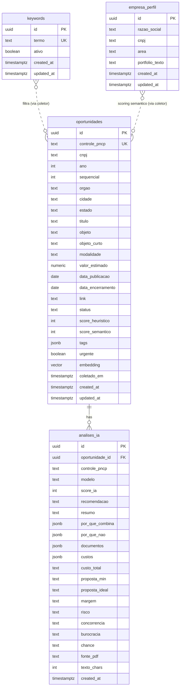

# Data Architecture: Radar PNCP

## Diagrama de Entidades (Mermaid)



## Contexto: Sem Autenticacao

Este projeto **nao tem autenticacao**. O frontend usa a `anon key` do Supabase. Todas as tabelas tem RLS habilitado, mas as policies refletem acesso publico:

- `oportunidades` e `analises_ia`: somente SELECT para anon (escrita via service_role nas Edge Functions).
- `keywords`: CRUD completo para anon (o usuario edita diretamente pelo frontend).
- `empresa_perfil`: CRUD completo para anon (o usuario edita o perfil pelo frontend; coletor le via service_role).

Quando auth for implementado, as policies de escrita em `keywords` e `empresa_perfil` devem ser restringidas. Marcadores `TODO[auth]` estao no SQL das migrations.

## Tabelas

### oportunidades

Cache de editais analisados vindos do PNCP. Escrita exclusiva via Edge Function (service_role). Leitura publica.

**Migration:** `20260608120000_init_radar.sql` + `20260608130000_v2_coleta_semantica.sql`

### analises_ia

Resultado da analise por LLM sobre o PDF do edital. FK para `oportunidades` com ON DELETE CASCADE. Escrita via service_role. Leitura publica.

**Migration:** `20260608120000_init_radar.sql`

### keywords

Fonte de verdade das palavras-chave monitoradas pelo radar. Substitui `DEFAULT_KEYWORDS` (localStorage/constante). O coletor diario (Edge Function `coletar-pncp`) consulta `SELECT termo FROM keywords WHERE ativo = true` para filtrar editais no PNCP.

```sql
create table if not exists public.keywords (
  id         uuid        primary key default gen_random_uuid(),
  termo      text        not null unique,
  ativo      boolean     not null default true,
  created_at timestamptz not null default now(),
  updated_at timestamptz not null default now()
);
```

**Migration:** `20260608140000_create_keywords_table.sql`

**Relacionamento conceitual:** keywords nao tem FK para oportunidades. A relacao e indireta — o coletor usa os termos ativos como filtro de busca na API do PNCP, e os resultados viram registros em `oportunidades`.

### empresa_perfil

Singleton: perfil da empresa (razao social, CNPJ, area de atuacao e texto de portfolio). Substitui o objeto `empresa` hardcoded em `src/lib/data.ts` e a constante `PERFIL` no coletor `coletar-pncp/index.ts`. O frontend edita a linha unica; o coletor le `portfolio_texto` para alimentar embeddings e scoring semantico.

```sql
create table if not exists public.empresa_perfil (
  id               uuid        primary key default '00000000-0000-0000-0000-000000000001'::uuid
                               check (id = '00000000-0000-0000-0000-000000000001'::uuid),
  razao_social     text        not null,
  cnpj             text        not null,
  area             text        not null,
  portfolio_texto  text        not null,
  created_at       timestamptz not null default now(),
  updated_at       timestamptz not null default now()
);
```

**Migration:** `20260608150000_create_empresa_perfil.sql`

**Garantia de singleton:** CHECK constraint no `id` fixa o UUID em `00000000-...0001`. Qualquer INSERT com outro id falha no CHECK; qualquer INSERT com o mesmo id falha no PK. Resultado: maximo 1 linha, impossivel de violar no nivel do banco.

**Relacionamento conceitual:** empresa_perfil nao tem FK para oportunidades. A relacao e indireta — o coletor le `portfolio_texto` para gerar embeddings e calcular score semantico, e o resultado e gravado em `oportunidades.score_semantico`.

## RLS Policies

| Tabela | SELECT | INSERT | UPDATE | DELETE |
|--------|--------|--------|--------|--------|
| oportunidades | anon, authenticated | -- (service_role) | -- (service_role) | -- (service_role) |
| analises_ia | anon, authenticated | -- (service_role) | -- (service_role) | -- (service_role) |
| keywords | anon, authenticated | anon, authenticated | anon, authenticated | anon, authenticated |
| empresa_perfil | anon, authenticated | anon, authenticated | anon, authenticated | anon, authenticated |

### Detalhamento das policies de keywords

| Policy | Operacao | Roles | Condicao | Nota |
|--------|----------|-------|----------|------|
| `keywords_select_public` | SELECT | anon, authenticated | `using (true)` | Leitura publica |
| `keywords_insert_public` | INSERT | anon, authenticated | `with check (true)` | TODO[auth]: restringir |
| `keywords_update_public` | UPDATE | anon, authenticated | `using (true) with check (true)` | TODO[auth]: restringir |
| `keywords_delete_public` | DELETE | anon, authenticated | `using (true)` | TODO[auth]: restringir |

### Detalhamento das policies de empresa_perfil

| Policy | Operacao | Roles | Condicao | Nota |
|--------|----------|-------|----------|------|
| `empresa_perfil_select_public` | SELECT | anon, authenticated | `using (true)` | Leitura publica |
| `empresa_perfil_insert_public` | INSERT | anon, authenticated | `with check (true)` | TODO[auth]: restringir |
| `empresa_perfil_update_public` | UPDATE | anon, authenticated | `using (true) with check (true)` | TODO[auth]: restringir |
| `empresa_perfil_delete_public` | DELETE | anon, authenticated | `using (true)` | TODO[auth]: restringir |

**Anti-pattern evitado:** Uma unica policy SELECT para anon+authenticated (nao duas policies separadas). Postgres faz OR entre policies do mesmo role — duplicar causaria vazamento.

## Triggers e Functions

| Trigger / Function | Tabela | Evento | O que faz |
|---|---|---|---|
| `public.set_updated_at()` | -- | -- | Function generica: seta `new.updated_at = now()` |
| `trg_oportunidades_updated` | oportunidades | BEFORE UPDATE | Atualiza `updated_at` via `set_updated_at()` |
| `trg_keywords_updated` | keywords | BEFORE UPDATE | Atualiza `updated_at` via `set_updated_at()` |
| `trg_empresa_perfil_updated` | empresa_perfil | BEFORE UPDATE | Atualiza `updated_at` via `set_updated_at()` |

A function `set_updated_at()` foi criada em `init_radar.sql` e e reutilizada em todas as tabelas com `updated_at`.

## Indices

```sql
-- oportunidades (init_radar.sql)
idx_oportunidades_controle  ON oportunidades (controle_pncp)   -- WHERE controle_pncp = $1
idx_oportunidades_status    ON oportunidades (status)           -- WHERE status = $1
idx_oportunidades_score     ON oportunidades (score_heuristico DESC NULLS LAST)  -- ORDER BY score

-- analises_ia (init_radar.sql)
idx_analises_oportunidade   ON analises_ia (oportunidade_id)    -- JOIN com oportunidades
idx_analises_controle       ON analises_ia (controle_pncp)      -- WHERE controle_pncp = $1
idx_analises_created        ON analises_ia (created_at DESC)    -- ORDER BY created_at

-- keywords (create_keywords_table.sql)
-- UNIQUE em `termo` ja cria indice implicito (busca por termo exato)
idx_keywords_ativo          ON keywords (ativo)                 -- WHERE ativo = true

-- empresa_perfil (create_empresa_perfil.sql)
-- Sem indice adicional: tabela singleton (1 linha), PK cobre a unica query (SELECT * LIMIT 1)
```

## Seed Data

### keywords

26 palavras-chave extraidas de `src/lib/keywords.ts` (constante `DEFAULT_KEYWORDS`). INSERT idempotente com `ON CONFLICT (termo) DO NOTHING`.

Termos: inteligencia artificial, chatbot, assistente virtual, atendimento digital, atendimento automatizado, automacao, software, licenciamento de software, desenvolvimento de sistema, sistema de informacao, sistema, integracao de sistemas, integracao, aplicativo, plataforma, dashboard, business intelligence, SaaS, transformacao digital, workflow, tecnologia da informacao, informatica, gestao eletronica, prontuario eletronico, portal do cidadao, central de atendimento.

### empresa_perfil

1 linha com dados reais extraidos de `src/lib/data.ts` e `coletar-pncp/index.ts`. INSERT idempotente via `ON CONFLICT (id) DO NOTHING`.

```sql
insert into public.empresa_perfil (razao_social, cnpj, area, portfolio_texto)
values (
  'AI Solution Exp LTDA - ME',
  '53.075.641/0001-71',
  'Automações, agentes de IA, integrações e atendimento automatizado',
  'Automações, agentes de IA, chatbots e assistentes virtuais, atendimento automatizado e digital, integrações de sistemas e APIs, desenvolvimento e licenciamento de software sob demanda, dashboards, BI, SaaS, transformação digital, portais e central de atendimento ao cidadão.'
)
on conflict (id) do nothing;
```

## Decisoes

| Decisao | Alternativa descartada | Motivo |
|---------|----------------------|--------|
| CRUD aberto para anon em keywords | Apenas SELECT para anon (igual oportunidades) | Projeto sem auth; frontend precisa editar keywords diretamente. Marcadores TODO[auth] garantem revisao futura |
| Reutilizar `set_updated_at()` existente | Criar function nova `fn_update_timestamp()` | Function ja existe e segue o mesmo padrao; evita duplicacao |
| Sem FK de keywords para oportunidades | FK via tabela intermediaria | Relacao e indireta (coletor usa keywords como filtro na API PNCP, nao como JOIN no banco) |
| TEXT NOT NULL UNIQUE para `termo` | Enum ou lookup table | Keywords sao dinamicas (usuario cria/remove); enum seria rigido demais |
| Indice em `ativo` | Sem indice (tabela pequena) | Query `WHERE ativo = true` e executada pelo coletor em toda coleta; indice garante performance mesmo com crescimento |
| Nome singular `empresa_perfil` | Nome plural `empresa_perfis` | Tabela singleton (1 linha de config); singular reflete a semantica de "o perfil da empresa", nao uma colecao |
| Singleton via CHECK no id (uuid fixo) | Boolean unique column / sem constraint | CHECK constraint garante no maximo 1 linha no nivel do banco, sem coluna auxiliar; mais limpo que boolean+unique e impossivel de violar |
| CRUD aberto para anon em empresa_perfil | Apenas SELECT para anon | Mesmo padrao de keywords — projeto sem auth; frontend precisa editar. TODO[auth] marcado |
| Sem indice adicional em empresa_perfil | Indice em cnpj ou razao_social | Tabela singleton com PK; qualquer query retorna a unica linha via PK scan — indice extra seria desperdicio |
